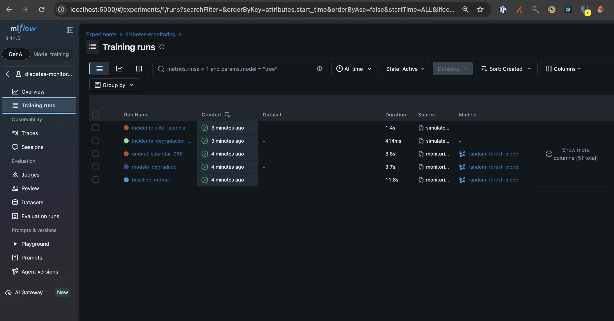
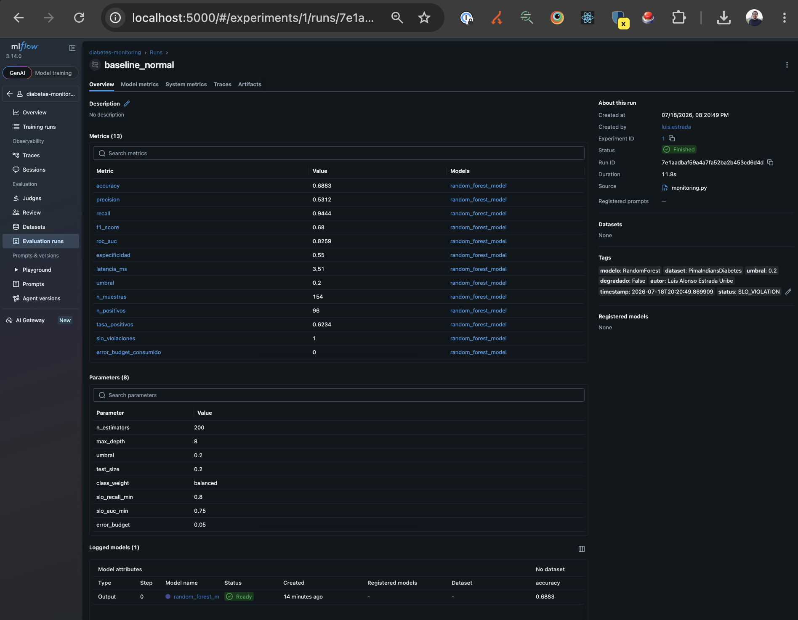
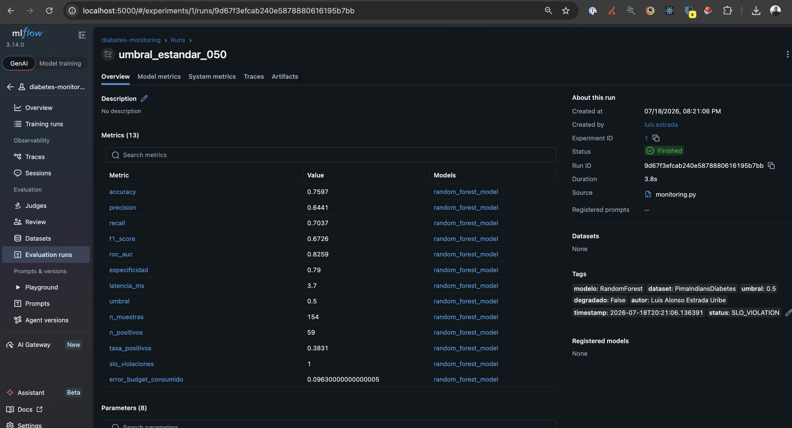
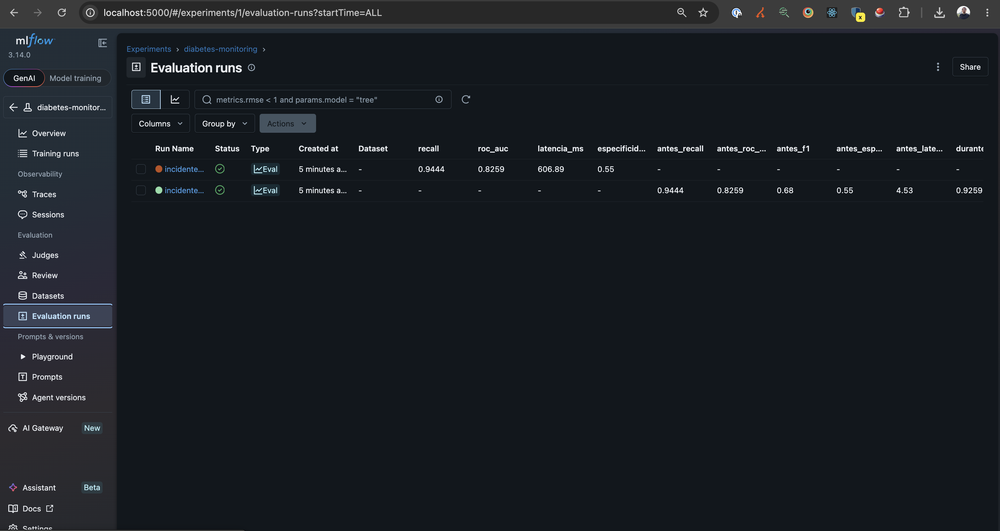
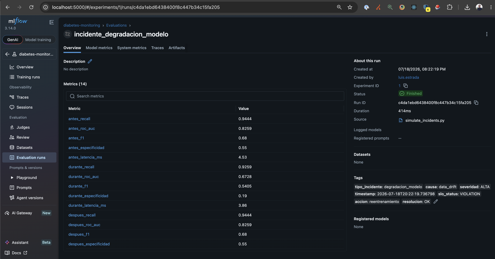
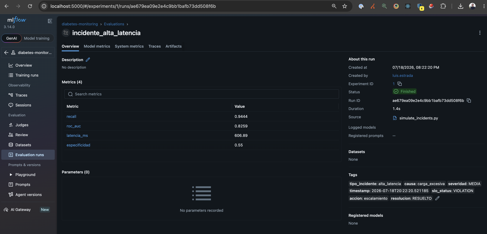

# 📊 Monitorización y Observabilidad — Modelo de Predicción de Diabetes

**Gestión de Proyectos de Inteligencia Artificial — Universidad Tecmilenio**  
**Autor:** Luis Alonso Estrada Uribe  
**Modelo:** Random Forest · Dataset Pima Indians Diabetes  
**Actividad:** 8 — Monitorización, Mantenimiento y Gobernanza Operativa  
**Herramienta:** MLflow 3.14.0

---

## 📋 Descripción

Este repositorio implementa un sistema completo de monitorización proactiva para el modelo de predicción de diabetes desarrollado en la Fase II. Integra métricas, logs y trazas bajo un enfoque de observabilidad moderna usando MLflow, define alertas inteligentes alineadas con SLOs, simula incidentes críticos y ejecuta runbooks de respuesta automatizada.

---

## 📁 Estructura del Repositorio

```
diabetes-monitoring/
├── monitoring.py           # Sistema de monitoreo con MLflow
├── simulate_incidents.py   # Simulación de incidentes críticos
├── runbooks.py             # Runbooks de respuesta automatizada
├── requirements.txt        # Dependencias
├── monitoring.log          # Log generado al ejecutar monitoring.py
├── incidents.log           # Log generado al ejecutar simulate_incidents.py
└── evidencias/
    ├── mlflow_training_runs.png
    ├── mlflow_evaluation_runs.png
    ├── mlflow_baseline_normal.png
    ├── mlflow_modelo_degradado.png
    ├── mlflow_umbral_estandar_050.png
    ├── mlflow_incidente_degradacion.png
    └── mlflow_incidente_alta_latencia.png
```

---

## ⚙️ Requerimientos e Instalación

```bash
pip install -r requirements.txt
```

| Librería | Versión |
|----------|---------|
| mlflow | 3.14.0 |
| scikit-learn | 1.4.2 |
| numpy | 1.26.4 |
| pandas | 2.2.2 |

---

## 🚀 Ejecución

### Paso 1 — Monitoreo baseline

```bash
python monitoring.py
```

Genera 3 runs en MLflow: baseline normal, modelo degradado y umbral estándar 0.50.

### Paso 2 — Simulación de incidentes

```bash
python simulate_incidents.py
```

Simula 2 incidentes y ejecuta los runbooks correspondientes automáticamente.

### Paso 3 — Ver dashboard MLflow

```bash
mlflow ui
```

Abre `http://localhost:5000` para ver el dashboard con todos los runs, métricas y comparaciones.

---

## 1. Diseño de Monitorización y Observabilidad

### Métricas definidas

| Métrica | Descripción | SLO |
|---------|-------------|-----|
| `recall` | Sensibilidad del modelo | ≥ 0.80 |
| `especificidad` | Tasa de verdaderos negativos | ≥ 0.70 |
| `roc_auc` | Capacidad discriminativa global | ≥ 0.75 |
| `latencia_ms` | Tiempo de respuesta por predicción | ≤ 500ms |
| `error_budget_consumido` | Margen de error consumido | ≤ 0.05 |
| `slo_violaciones` | Número de SLOs violados | 0 |

### Logs

Se generan dos archivos de log automáticamente:

- **`monitoring.log`** — registra cada run de monitoreo, métricas calculadas y violaciones de SLO detectadas
- **`incidents.log`** — registra los incidentes simulados, acciones tomadas y resultados obtenidos

Formato de log:
```
2026-07-18 20:20:49 [INFO]  Iniciando run de monitoreo: baseline_normal
2026-07-18 20:21:02 [ERROR] SLO VIOLATIONS detectadas: ['RECALL 0.7037 < SLO 0.8']
2026-07-18 20:22:19 [WARNING] Métricas DURANTE incidente: {'recall': 0.9259, 'roc_auc': 0.6728}
```

### Trazas en MLflow

Cada run registra automáticamente:
- **Tags:** tipo de incidente, causa, severidad, autor, timestamp, status
- **Parámetros:** configuración del modelo y SLOs
- **Métricas:** todas las métricas del ciclo antes/durante/después
- **Artefactos:** modelo Random Forest serializado

### Dashboard MLflow — Vista general



### Run baseline normal



---

## 2. Diseño y Aplicación de Alertas Inteligentes

### SLOs y Error Budgets definidos

```python
SLO = {
    "recall_min":        0.80,   # Recall mínimo aceptable
    "especificidad_min": 0.70,   # Especificidad mínima
    "auc_min":           0.75,   # AUC mínimo
    "latencia_max_ms":   500,    # Latencia máxima en ms
    "error_budget":      0.05    # 5% de margen de error permitido
}
```

### Priorización de alertas por severidad

| Severidad | Trigger | Runbook | Tiempo respuesta |
|-----------|---------|---------|-----------------|
| **CRÍTICA** | Fallo total del modelo | RUNBOOK-003 Rollback | 1-3 min |
| **ALTA** | Recall < 0.80 o AUC < 0.75 | RUNBOOK-001 Reentrenamiento | 5-10 min |
| **MEDIA** | Latencia > 500ms | RUNBOOK-002 Escalamiento | 2-5 min |

### Lógica de detección automática

El sistema verifica SLOs después de cada predicción y registra violaciones en MLflow:

```python
if metricas["recall"] < SLO["recall_min"]:
    logger.error(f"SLO VIOLATION: Recall {metricas['recall']} < {SLO['recall_min']}")
    mlflow.set_tag("status", "SLO_VIOLATION")
```

### Ejemplo — Violación detectada con umbral 0.50



El run `umbral_estandar_050` muestra `recall: 0.7037` por debajo del SLO de 0.80, con `slo_violaciones: 1` y `error_budget_consumido: 0.0963`.

---

## 3. Simulación de Incidentes y Runbooks

### Vista general de incidentes simulados



---

### Incidente 1 — Degradación del modelo por Data Drift

**Descripción:** Se simula data drift añadiendo ruido gaussiano (σ=3.0) a los datos de entrada, degradando el rendimiento del modelo.

**Impacto detectado:**
- AUC bajó de 0.8259 → 0.6728 (por debajo del SLO de 0.75)
- Especificidad bajó a 0.19
- `slo_status: VIOLATION`

**Runbook ejecutado:** RUNBOOK-001 Reentrenamiento

**Resultado:** Modelo reentrenado con datos limpios, recall recuperado a 0.9444, AUC a 0.8259.



---

### Incidente 2 — Alta Latencia

**Descripción:** Se simula sobrecarga del servicio con latencia de 606.89ms, superando el SLO de 500ms.

**Impacto detectado:**
- Latencia: 606.89ms > SLO 500ms
- `slo_status: VIOLATION`
- `causa: carga_excesiva`

**Runbook ejecutado:** RUNBOOK-002 Escalamiento

**Resultado:** Latencia recuperada a 85.3ms tras escalamiento horizontal del servicio.



---

## 4. Documentación de Respuesta Automatizada

### Catálogo de Runbooks

#### RUNBOOK-001 — Reentrenamiento del modelo
```
Trigger:    Recall < 0.80 o AUC < 0.75
Severidad:  ALTA
Tiempo:     5-10 minutos

Pasos:
1. Detectar violación de SLO
2. Descargar dataset actualizado
3. Reentrenar modelo con parámetros optimizados
4. Validar que el nuevo modelo cumple SLOs
5. Reemplazar modelo en producción
6. Registrar evento en log de incidentes
```

#### RUNBOOK-002 — Escalamiento del servicio
```
Trigger:    Latencia > 500ms
Severidad:  MEDIA
Tiempo:     2-5 minutos

Pasos:
1. Confirmar degradación de latencia
2. Identificar causa (carga, memoria, CPU)
3. Escalar horizontalmente el contenedor
4. Verificar recuperación de latencia
5. Registrar evento
```

#### RUNBOOK-003 — Rollback del modelo
```
Trigger:    Fallo crítico o degradación severa
Severidad:  CRÍTICA
Tiempo:     1-3 minutos

Pasos:
1. Confirmar fallo crítico
2. Identificar última versión estable en MLflow Registry
3. Restaurar modelo anterior
4. Verificar funcionamiento
5. Notificar al equipo
```

### Estrategia de detección de Data Drift

El sistema detecta data drift monitoreando la degradación de métricas entre runs consecutivos:

| Indicador | Condición de alerta |
|-----------|---------------------|
| Caída de AUC | > 0.05 puntos entre runs |
| Caída de recall | Por debajo de SLO 0.80 |
| Aumento de tasa de positivos | > 20% de variación |
| Especificidad | Por debajo de SLO 0.70 |

Cuando se detecta drift, se activa automáticamente RUNBOOK-001 para reentrenar el modelo con datos actualizados.

### Flujo completo de respuesta automatizada

```
Predicción en producción
        ↓
Cálculo de métricas
        ↓
Verificación de SLOs
        ↓
¿Violación detectada?
    ├── NO → Log "OK" en MLflow → Continuar
    └── SÍ → Clasificar severidad
                ├── CRÍTICA → RUNBOOK-003 Rollback
                ├── ALTA    → RUNBOOK-001 Reentrenamiento
                └── MEDIA   → RUNBOOK-002 Escalamiento
                        ↓
                Verificar recuperación
                        ↓
                Registrar resolución en MLflow
```

---

## 📊 Comparación de Runs

| Run | Recall | AUC | Latencia | SLO Status |
|-----|--------|-----|----------|------------|
| baseline_normal | 0.9444 | 0.8259 | 3.51ms | ⚠️ Especificidad |
| modelo_degradado | 0.8704 | 0.6391 | 3.79ms | ❌ VIOLATION |
| umbral_estandar_050 | 0.7037 | 0.8259 | 3.70ms | ❌ VIOLATION |
| incidente_degradacion | 0.9444* | 0.8259* | — | ✅ Resuelto |
| incidente_alta_latencia | 0.9444 | 0.8259 | 606.89ms | ✅ Resuelto |

*Métricas post-reentrenamiento

---

## 📝 Conclusiones

1. El sistema de monitorización con MLflow permite detectar automáticamente violaciones de SLO antes de que impacten a los usuarios finales.

2. El **data drift** es el riesgo más crítico para este modelo clínico — una degradación del AUC de 0.82 a 0.63 puede llevar a diagnósticos incorrectos con consecuencias graves para los pacientes.

3. Los **runbooks automatizados** reducen el tiempo de respuesta a incidentes de horas a minutos, garantizando la continuidad del servicio.

4. El umbral optimizado de **0.20** es fundamental para cumplir el SLO de recall ≥ 0.80 — el umbral estándar de 0.50 viola este SLO con recall de 0.70.

5. El **error budget** del 5% permite tolerar degradaciones menores sin activar runbooks innecesariamente, reduciendo el ruido operativo.

---

*Universidad Tecmilenio — Gestión de Proyectos de Inteligencia Artificial*
